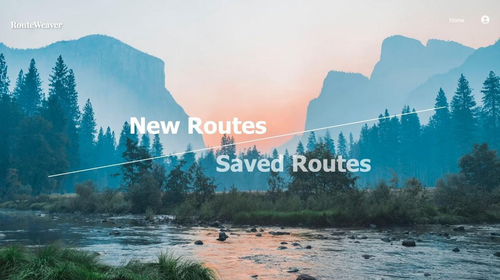
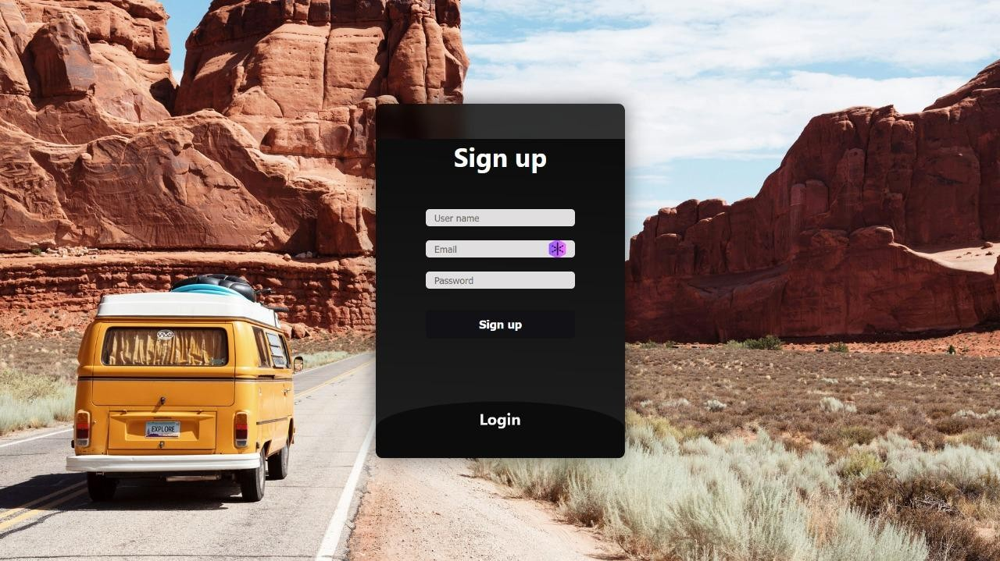
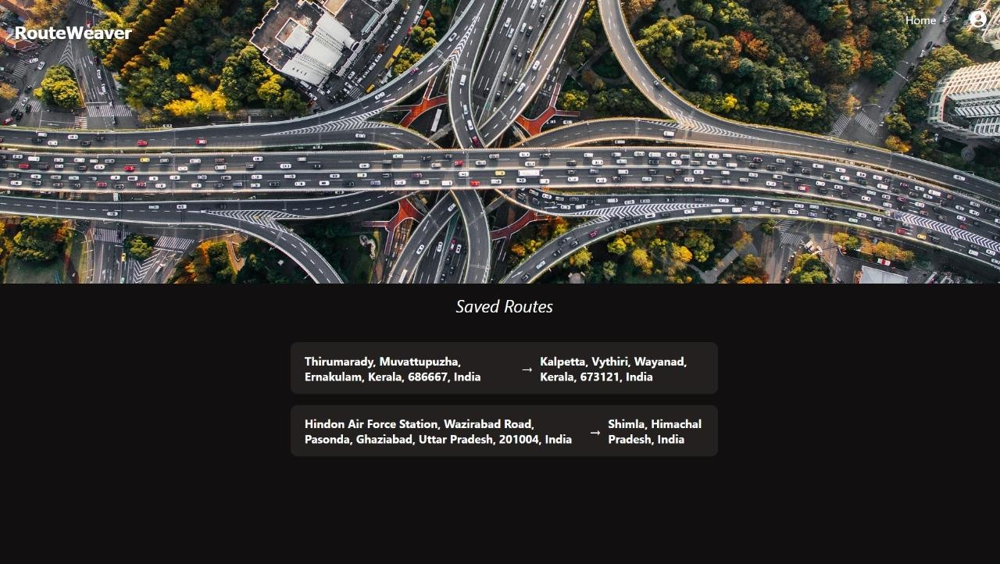
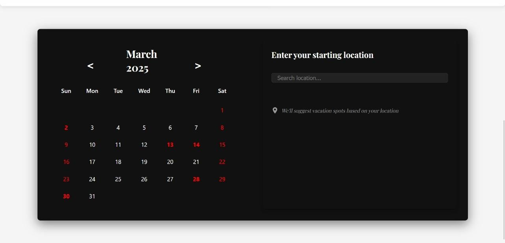
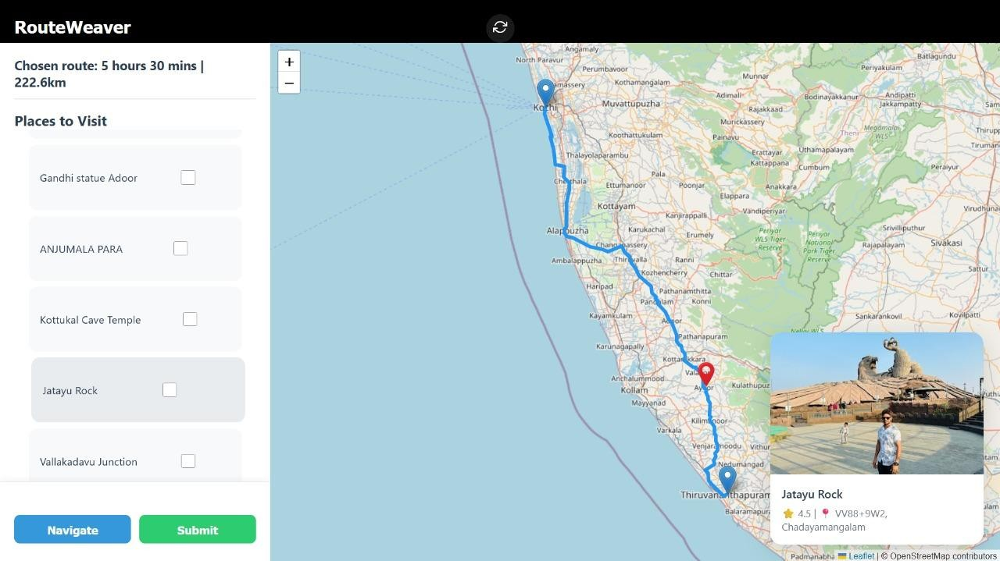
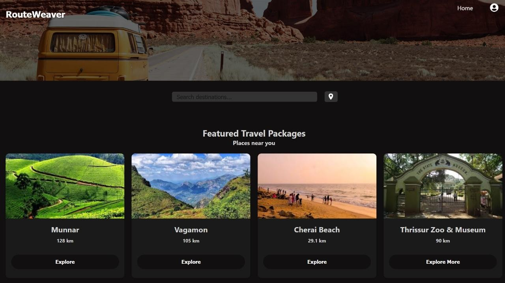

# Project_RouteWeaver
 # 🧭 RouteWeaver

**RouteWeaver** is an intelligent, scalable, and personalized itinerary manager designed to simplify road trip planning. Built with a minimal and clutter-free interface, it helps users plan efficient, customized routes without being overwhelmed by excessive information.  

---

## 🚀 Overview

RouteWeaver redefines travel planning through intelligent automation and personalization.  
It allows users to:
- Create and save **custom travel routes**.
- Explore **smart travel packages** near their location.
- Get **personalized suggestions** through keywords or preferences.
- Use **SmartVacay**, an AI-driven feature that analyzes work calendars to suggest the best travel dates.

---

## 🧩 Key Features

- **Custom Route Planning:** Build personalized itineraries with real-time optimization using the Google Maps API.  
- **SmartVacay:** Smart recommendations based on your work calendar for balanced work-leisure travel.  
- **Dynamic Suggestions:** Filter destinations by interest — nature, food, history, adventure, and more.  
- **Saved Routes:** View, manage, and relaunch previous trips.  
- **Travel Packages:** Pre-built optimized routes for quick getaways.  
- **Secure Login & Data Storage:** Managed via Node.js authentication and MongoDB.

---

## 🛠️ Tech Stack

- **Frontend:** React.js (with Vite)
- **Backend:** Node.js + Express.js
- **Database:** MongoDB
- **APIs:** Google Maps API, OSRM API, Gemini API, Google Calendar API

---

## 🖼️ Application Screens

### 🏠 Home Page
The entry point showcasing RouteWeaver’s minimal and elegant design.


---

### 🔐 Login / Signup
Secure authentication and user access.


---

### 🗺️ Query Page
Generate custom routes based on your interests, start/destination, and trip preferences.


---

### 💾 Saved Routes
Access your previously planned or completed journeys.


---

### 🌴 SmartVacay
AI-driven vacation planner that syncs with your calendar to suggest travel windows.


---

### 💡 Suggestions Page
Get intelligent recommendations for places to visit based on interest keywords.


---

### ✈️ Travel Packages
Explore pre-built optimized travel packages near your current location.


---

## ⚙️ Installation

```bash
# Clone the repository
git clone https://github.com/ryygeorge/Project_RouteWeaver

#Start the backend services
cd Backend
npm install
npm start

# Navigate into the project directory
cd RouteWeaver

# Install dependencies
npm install

# Run the development server
npm run dev
